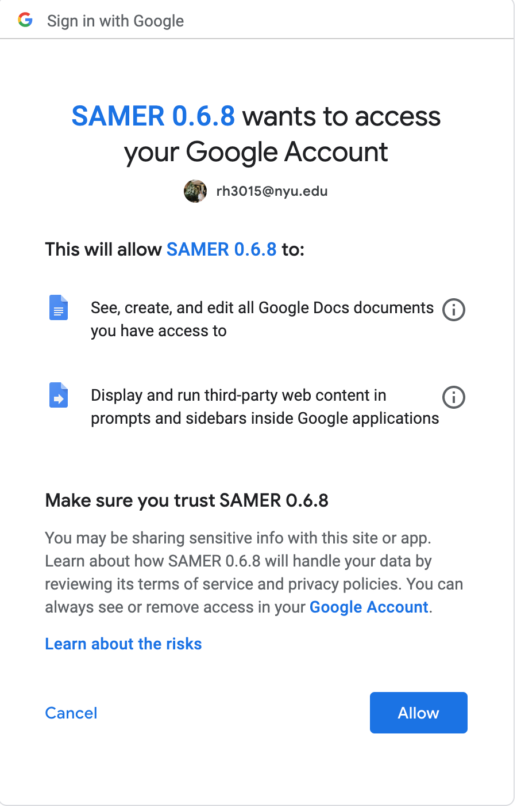

# SAMER Google Docs Add-On
Please read below for a brief guide to navigating the world of Google Apps Scripts (which are used to create Add-ons):

## Types of Google Apps Scripts 
There are two types of Google Apps Scripts: [Container-bound](https://developers.google.com/apps-script/guides/bound) scripts and [standalone](https://developers.google.com/apps-script/guides/standalone) scripts. The SAMeR Add-On is a container-bound script, meaning it was created from a Google document (the container) and is attached to it. This is in contrast to a standalone script, which is created in Google Drive and is not bound to any file. As the name suggests, container-bound scripts are bound to their container files and cannot be detached from them. If the file (in this case the Google document) gets deleted, so does the SAMeR script that was attached to it. Here are some noteworthy properties of container-bound scripts:
- You can only run a container-bound script if you own the container file or have permission to edit it.
- If you create a copy of the container file, the add-on script will also get copied with the file. You will be able to access and run the add-on on the copy file.
- Therefore, one way to share a container-bound add-on with others is to provide them with copies of the container file.

## Deploying Add-ons and Version Control
To create versions of the add-on, we must first deploy the apps script project. An [apps-script deployment](https://developers.google.com/apps-script/concepts/deployments) creates a version of the app that can be used as an API, a web application, or an add-on. If we want to publish our add-on on the Google Workspace Marketplace to be available for other users, we are first required to deploy it. After publishing, we will also be able to use deployments to control which version of our code users can access. 

There are two types of deployments: *Head Deployments* and *Versioned deployments*. You can read more about them in the link provided above. In short, *Head deployments* are always in sync with the currentl project code and should be used to test the code before publishing it. *Versioned deployments*, on the other hand, reflect a snapshot of your code that is connected with a specific numbered version of the project, and they do not get updated when you modify your code. 

Note that the Apps Script editor has no interface for seeing/editing/reverting back to the code of earlier versions. However, you can do so using the [Clasp command line tool](#clasp-deploy).

Also note that deploying an apps script project is **not** the same as publishing it. Publishing an add-on means making it available to users on the Google Workspace Marketplace, while deploying an add-on only creates a new version of it, but it doesn't publish it anywhere. See the section below on publishing add-ons.

Final note: Versioned deployments of container-bound scripts are also bound to their container. If you deploy a new version of SAMeR, then delete the Google document to which it is bound, the entire apps script project (including any deployed versions) will be deleted as well. 

### Creating a Versioned Deployment
To create a versioned deployment and/or publish the add-on to the Google Workspace Marketplace, you must first link it to a Google Cloud Platform (GCP) project. Apps Scripts projects use GCP mainly to manage authorization, perissions and API services and configure other project settings. You can read more about how, why, and when GCP is used with Apps Script on [this page](https://developers.google.com/apps-script/guides/cloud-platform-projects#switching_to_a_different_standard_gcp_project). 

In summary, whenever you create a Google apps script, a default GCP project is created automatically. However, this GCP project is hidden from most users, so we cannot use it to configure project settings. This is why, in order to deploy our apps script or publish it, we must switch the apps script project to use a standard GCP project. When you do so, you will be able to access all project settings, including enabling APIs and modifying authorization credentials, from your [GCP console](https://console.cloud.google.com/).

### Linking the Apps Script Project to a GCP Project
Follow these steps to link your apps script project to a GCP project:
1. Navigate to the [GCP console](https://console.cloud.google.com/) and create a new project if necessary or open an existing project.
2. On your dashboard, you will see a "Project Info" panel containing details about your project, including the name, project ID and project number. Copy the project number.
3. Navigate to the Apps Scripts editor. On the left panel, click the settings icon (shown below). This will take you to the project settings page.

4. At the bottom of the page, you will find a "Google Cloud Platform (GCP) Project" section. Click on "Change project" and paste the project number of your GCP project that you copied earlier. Click "set project".

### Filling the OAuth Consent Screen
Once you have linked your apps scripts project to a standard GCP project, you must fill the OAuth consent screen. The OAuth consent screen is the prompt screen that users will see when they try to install your app. It lets them know what kind of data this app will use and who is requesting it. For example, if your apps script uses the Google Gmail API or the Google Calendar API, the OAuth screen will let the users know that their emails/calendar may be accessed. Here is an example of the SAMeR OAuth consent screen:


To set up the OAuth consent screen, go to your GCP Console and do the following:
1. Choose the same GCP project you linked to the apps script project
2. Open the side menu on the left side of the screen
3. Go to "APIs & Services" > "OAuth consent screen"
4. Fill the information required by the page. Note that you will be asked about "scopes", which represent the kinds of permissions you need from the users to access their data (e.g. email data, google cloud storage data, etc.). The SAMeR add-on does not require any of these scopes, as it doesn't use any additional Google APIs. Therefore, you do not need to fill anything in this section. Note that you will also need to set the User type. You can always change the user type later on if you wish. 

Once you have filled the OAuth consent screen, you can finally create a versioned deployment of your apps script project. Follow the instructions [here](https://developers.google.com/apps-script/concepts/deployments#create_a_versioned_deployment) to create a new deployment.

## Using the Clasp Command Line Interface
Because container-bound scripts are attached to their containers and could be easily deleted, it's important to use other version control tools (like Git) to keep track of changes to the code and avoid losing any progress. Fortunately, Google provides an open-source command line tool that enables you to easily clone an apps script project to your local file system, from which you can push it to a Github repository. This tool is called [Clasp](https://developers.google.com/apps-script/guides/clasp).

Clasp is a command line interface that allows you to develop and manage Apps Script projects from your local machine rather than the online Apps Script editor. You can do the following using clasp:
- Develop apps scripts locally
- Download apps scripts projects from your Google drive to your local file system
- Edit apps scripts on your local file system, then push your changes to your drive
- Manage your versioned deployments

### Some Useful Clasp commands
The only requirement to install Clasp is to have Node.js installed on your machine. You can follow the installation instructions [here](https://developers.google.com/apps-script/guides/clasp#installation).

Clasp has a few, easy commands to use. Here are the main ones you may need to edit the SAMeR scripts on your local machine:
1. Login to your Google account using:
```
clasp login
```
2. Clone the SAMeR Apps Scripts using 
```
clasp clone <Script ID>
```
This command will clone all the SAMeR script files into the current folder. You can find the SAMeR Script ID by going to the **Apps Scripts Editor** > **Settings**, under the "IDs" section.

3. Download (pull) a script project
To pull the script project from the online editor to your local machine, run:
```
clasp pull
```
4. To upload the script project files from your local machine to the online editor, run:
```
clasp push
```
**Note that `clasp pull` will _replace_ all the apps scripts files in your local editor, and `clasp push` will *replace* all the apps scripts files in the online editor.** Therefore, make sure you avoid editing on your local machine and the online editor at the same time.

Also note that you can create a `.claspignore` file to specify which files should be ignored when you push/pull. By default, files that begin with `.` or that don't have an accepted file extension (`.html`, `.gs`, `.json`) will be ignored. 

### <a name="clasp-deploy"></a>Editing deployed versions using Clasp
You can use clasp to pull the code from a specific deployed version of your apps scripts project:
```
clasp pull --versionNumber <number>
```
Where `number` is the version number you want to pull. Note that, as mentioned above, the `pull` command will replace all the files in your local directory, so be careful to save your changes somewhere (e.g. Github) before pulling a certain version.

You can then 'revert' back to this version on the online editor by using `clasp push`. Again, note that this will replace all the existing files in the online editor, so make sure you save any changes (e.g. create a new version) before reverting to an old version.

If you make changes to this version and decide to redeploy it, you can do so using:
```
clasp deploy --deploymentId <deploymentID>
```
Where the `deploymentID` can be copied from the "Manage deployments" screen on the online editor. This will create a new version with the same deployment ID and archive the previous version. 

To see other clasp commands available, you can go through this [codelab](https://codelabs.developers.google.com/codelabs/clasp/#0). You can also find the full clasp documentation [here](https://github.com/google/clasp). 


## Publishing a Google Apps Script
To publish an add-on to the Google Workspace Marketplace, we must first deploy a version of the app. [This page](https://developers.google.com/workspace/marketplace/how-to-publish) provides a detailed guide on how to publish an add-on. If you created a versioned deployment, you'll have already completed the first 2 steps (linking the app to a GCP project and filling the OAuth consent screen). The final steps are:
- Enable the Google Marketplace SDK and configure your application.
 
    In the "App configuration" section, choose "Docs Add-on" as the application type, enter the Script ID (found under **Apps Scripts editor** > **Settings**), and choose a deployed version to publish. Note that, once you publish the add-on, you can always change the version accessible to your users by simply changing the version number in this section and clicking "save". When you do so, the new version will automatically be used for all users, even those who have already installed the add-on.

    Note that this section also allows you to choose the visibility of your application. Public visibility means that the add-on will be shown in browse or search results for all users. Private visibility means that the add-on will only be shown for users in your organization (NYU). Non-NYU users will not be able to find your add-on, even if they search for it. Once you select the visibility preference, you **cannot** change it later on, so please choose carefully. Whether you choose private or public, you also have the option of publishing the add-on as *unlisted*, which means that users can only access it using the direct URL, and it will not be shown on any browse or search results. The unlisted option can always be changed after publishing.

-  Create a store listing

    This involves uploading your icons, screenshots of how the app works, terms of service, privacy policy, and support URLs, etc. 

- Publish the application

Once you fill out the store listing form, you will be able to publish the application. If you chose the public visibility preference, your app will have to be reviewed by Google before being published. If you chose the private visibility, your app will be immediately published without being reviewed. 

Note that it takes a few minutes after publishing for the app to actually become available on the [Google Workspace Marketplace](https://workspace.google.com/marketplace). You can always unpublish the app later on if you wish. Once the app is published, people can install it through the Google Workspace Marketplace, and it will show up under "Add ons" on all of their Google docs.

**Note that if you publish an add-on that is a container-bound script (e.g. the SAMeR interface), then you delete the container file, users will not be able to install the add-on anymore. The store listing will still be displayed on the Google Workspace Markerplace, but if users try to install the app, they will face an error. Therefore, it is important to keep the original container-bound script even after you publish the app.**


