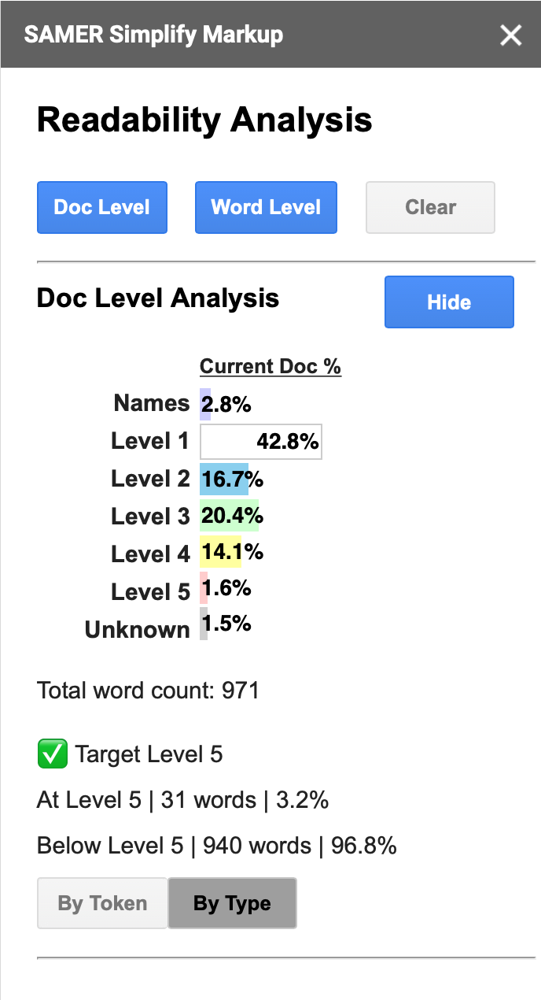
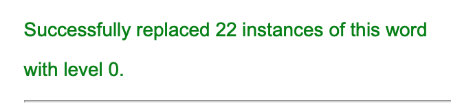

# SAMER Google Docs Add-On
This is a Google Docs Add-on tool that analyzes the readability of Arabic text in a Google Document.

This tool falls under the _Simplification of Arabic Masterpieces for Extensive Reading_ (SAMER) project developed by the Computational Approaches to Modeling Language (CAMeL) Lab at New York University Abu Dhabi (NYUAD).

More details on the SAMER project can be found [here](https://nyuad.nyu.edu/en/research/faculty-labs-and-projects/simplification-of-arabic-masterpieces-for-extensive-reading.html). 

The SAMER Leveled Readability Lexicon used in this tool can be found [here](https://camel.abudhabi.nyu.edu/samer-readability-lexicon/).

This README explains how to run and use the SAMER add-on tool. For more information on how to deploy new versions of this tool or how to publish it to the Google Workspace Marketplace, please consult the [AboutGDocsAddOns.md](https://github.com/reem-hazim/samer-add-on/blob/main/AboutGDocsAddOns.md) document

## Running the tool
To run the tool on a Google Docs:
1. Click on the "Add-ons" tab on the toolbar. This will display the list of add-ons currently installed:

2. Select "SAMER 0.7.0", then click "Launch SAMER". This will open a new page that requests your authorization to run the SAMER script.
<br />
3. Once you approve the request, repeat steps 1 and 2 to run the SAMER tool. When the script has succesfully completed, you should see the SAMER sidebar on the right side of your screen:


## Supported Features
This tool supports a few features which are listed below:

### Doc-Level Analysis
This feature analyzes a selection of text, produces statistics about the readability level of the text and highlights each word in the text according to its readability level. 

**Analyzing the entire document**
<br />
To analyze the entire document, simply click the "Doc Level" button in the sidebar, **without selecting any text**. This should highlight all the words in the document by their readability level. This feature will also produce a bar chart containing the frequency percentage of each readability level in the document. Under the bar chart, the total word count is displayed, followed by the target level and the number and percentage of words above, at, and below the target level (See example below).


**Analyzing a selection of text**
<br />
To analyze only a selection of text, highlight the text you wish to analyze and click the "Doc Level" button. This will produce the same statistics as described above.

**Toggling the doc-level analysis section**
<br />
For your convenience, you can hide the doc-level analysis section by clicking on the "hide" button. You can then re-display it by clicking on the "show" button.
<br />


**Readability analysis by type**
<br />
By default, the SAMER add-on calculates the total number of words in each level, including any repeated words or lemmas. This can potentially skew the calculated target level if a single word or lemma at a certain level is repeated many times. For instance, if the word "أبابة" was repeated several times in the same text, it will count heavily towards the frequency of Level 5 in the text. However, we might expect the reader to understand that word from context if it is repeated so many times. Therefore, it may be beneficial to look at an analysis of the text that uses the percentage of **unique lemmas** in each level, rather than the percentage of words. 

To see the analysis by unique lemmas (by "type"), click on the "by type" button at the bottom of the analysis section. To toggle back to the analysis by number of words (by "token"), click on the "by token" button


### Word-Level Analysis
This feature analyzes a single word and produces a list of disambiguated lemmas and their levels. This feature also enables the user to forcefully assign a word to a certain lemma if the lemma selected by the disambiguator is incorrect. In addition, for every lemma, the tool displays a list of related words that have a lower readability level than the lemma to help the user with simplifying the text.

To use this feature, select a single word in the text and click the "Word Level" button in the sidebar. **Note that the tool will return an error if you have not selected anything, or if you have selected more than one word**.


The lemma that is selected by the disambiguator will be highlighted.

**Forcefully assigning a level**
<br />
In some cases, the disambiguator may select the wrong lemma for a word. If you suspect that a word's readability level is too high or low, you can select the word and perform word-level analysis to display all the lemmas produced by the morphological analyzer and their levels. If you notice that the wrong lemma is selected, resulting in an incorrect level assignment, you can forcefully assign the level of the word by clicking the "Assign" button next to your desired level. This button overrides the level selected by the tool by adding "#[level]#" to the beginning of the word.
<br />


Alternatively, you can manually assign a level by adding "#[level]#" at the beginning of the word. Make sure the `level` is an Arabic number between 0 (proper noun) and 5, like the example below:
```
#٠#جميل
```

**Assign All**
<br />
The "Assign" button only assigns the selected instance of the word to the desired level. If you wish to assign all instances of the word to this level, use the "Assign All" button. This will add "#[level]#" to all instances of the selected word in the document. Once the assignment is complete, it will display the number of instances updated:
<br />


**Related Word Suggestion**
<br />
To facilitate the simplification of Arabic texts, the SAMER tool can suggest a list of related words (synonyms, antonyms, and hypernyms) whose levels are lower than the level of that lemma. To display the suggestions, click on the "+" sign to the left of your chosen lemma. This will display the related words broken down by category (synonyms, antonyms, hypernyms) and by level. To hide the suggestions section again, click on the "-" button to the left of the lemma.
<br />


*Note that the related words are taken from Arabic WordNet*

### Clearing the Analysis
To clear the analysis from the sidebar and remove the highlight effect from the entire document, click the "Clear" button **without selecting any text**. If you only wish to clear the highlight effect from a certain selection of text, you can select the text and click the "Clear" button. 